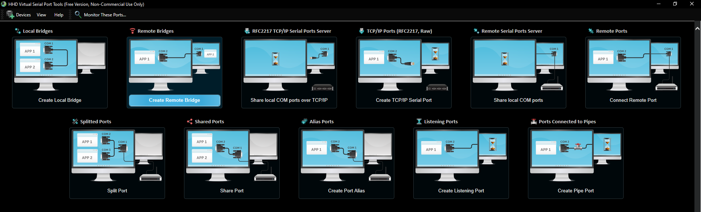

# Exactly what the hell is this repo all about?


well your gewinn scale and all other things are in iot device using real serial ports to sending data. so this repo basically just wrap that data sended into computer and into our socket server. then the server processed the received data into one of our clients (web / apps)

# Testing
you need a virtual com, like a pair of com 5 and com 6. you can do that by downloading virtual serial port driver
recommended and free : 

https://freevirtualserialports.com/

- change the connection in test-read.js and test-write.js with your virtual port.
- for example if my computer is com5 the other computer that receiving one is com6. then in test-read.js you specify com6. and in test-write.js you specify com5.
- run the read first
- and then run the write.

if you getting data in read, then the connections is successful...

now test it on real device in the fields.

# build it to exe with pkg.
- npm i -g pkg
- cd to this directory and npm i
- configure the scripts especially this parts to suites your needs
```js
const wsServer = "ws://c4budiman.com:9334";
const readoutPort = "COM7";
const group = "gewinn-scale";
const location = "cikampek";
const type = 1;
```
- configure package.json with the one that you want to build, specify it in bin sections
```json
...
"bin": "timbangan-biasa.js"
...
```
- run this in this directory : `pkg .`
- output will be on .dist/timbangan.exe rename it with your desired name.


## params for gewinn

```js
const readPort = new SerialPort({
  path: 'COM7',
  baudRate: 9600,
  dataBits: 8,
  parity: "none",
  stopBits: 1,
  autoOpen: false,
});
```

## params for little scaler
```js
const readPort = new SerialPort({
  path: 'COM7',
  baudRate: 2400,
  dataBits: 7,
  parity: "even",
  stopBits: 1,
  autoOpen: false,
});
```


# groups :
1. `little-scale`
2. `gewinn-scale`

# location: 
1. `cikampek`
2. `cikawung`

# type :
1 => notification weight
2 => notification user
3 => notification apis